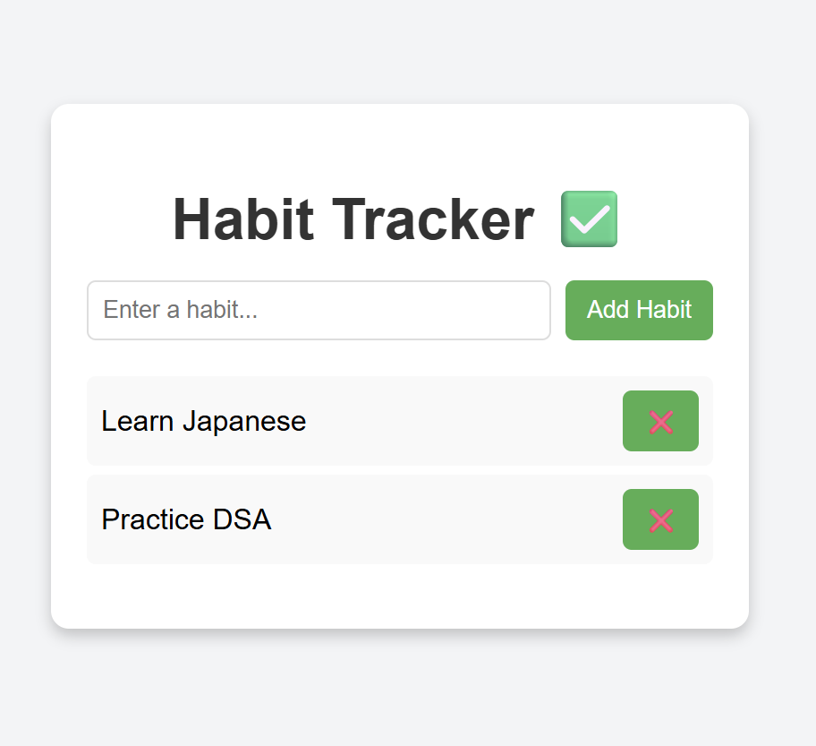

 🌱 Habit Tracker Website

A simple and clean **Habit Tracker** website built with HTML, CSS, and JavaScript.  
Track your daily habits, mark them as completed, and stay consistent 🚀.


 🔗 Live Demo
👉 [View on GitHub Pages](https://Prasanna6725.github.io/Habit_Tracker_project/)


 📸 Sample pic



 ✨ Features
- ➕ Add new habits  
- ✅ Mark habits as completed (toggle on/off)  
- ❌ Delete habits easily  
- 💾 Simple, lightweight, runs directly in your browser  


 🛠️ Tech Stack
- **HTML5**
- **CSS3**
- **JavaScript**


## 🚀 How to Run Locally
1. Clone this repository:
   ```bash
   git clone https://github.com/Prasanna6725/Habit_Tracker_project.git
